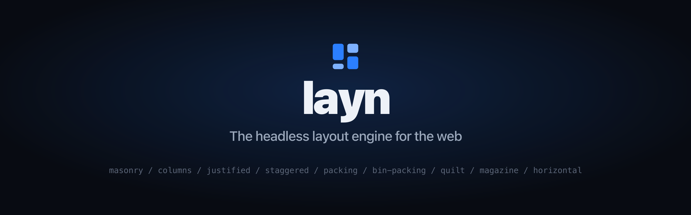
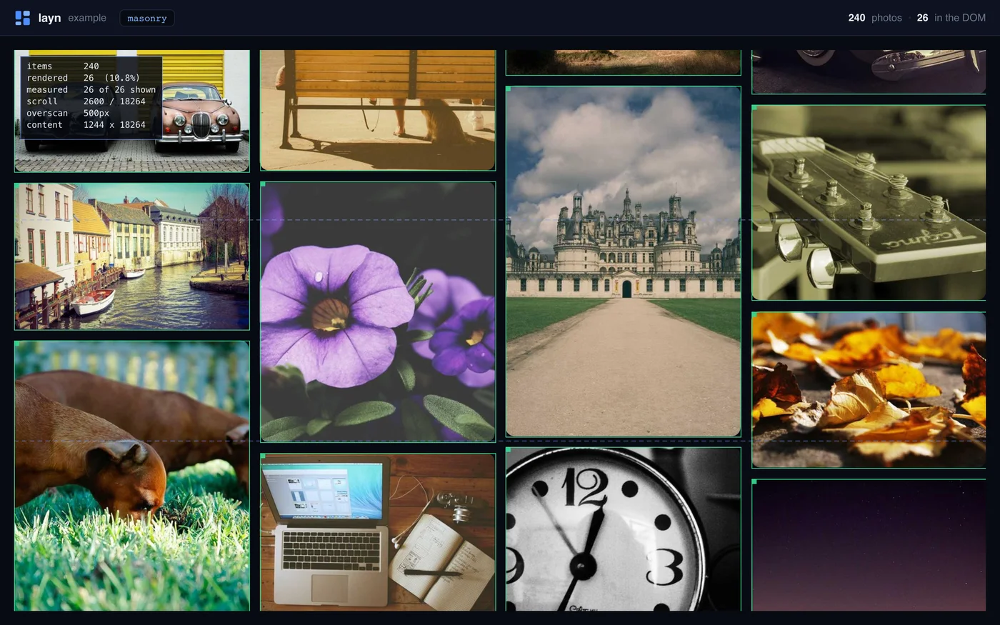

<div align="center">



<br />
<br />

Compute your layout once, render it anywhere. Deterministic on the server, virtualized on the client, rendered by any framework.

[](https://www.npmjs.com/package/@laynjs/core)
[](https://github.com/laynjs/layn/actions/workflows/ci.yml)
[](./LICENSE)

[Documentation](https://docs.layn.io) · [Playground](https://play.layn.io) · [Website](https://layn.io) · [Try it on StackBlitz](https://stackblitz.com/github/laynjs/layn/tree/main/templates/react)

</div>

## What is layn?

layn is a layout engine, not a grid component. The core is a pure function of state - `(items + config + measurements) -> positions + contentSize` - with no DOM and no framework inside. It hands you a rectangle for every item and stays out of your markup.

Because the positions come from your data rather than from measuring the DOM, the server and the client compute the same rectangles. Hydration never mismatches and there is no layout shift.

- **Headless** - the engine computes positions; your framework renders.
- **SSR-deterministic** - data-first measurement (aspect ratio or given dimensions), refined by `ResizeObserver` after paint.
- **Virtualization built in** - a spatial index keeps only the visible items in the DOM, on every algorithm.
- **Nine layouts** - masonry, columns, justified, staggered, packing, bin-packing, quilt, magazine, horizontal masonry.
- **Motion** - FLIP animations on layout change, enter and exit transitions, drag to reorder.
- **Real-world features** - sections with sticky headers, infinite scroll, responsive column counts read from the container, RTL, `scrollToItem`.
- **Devtools** - an overlay drawing the engine's own rectangles, the overscan band, and which tiles are measured rather than estimated.
- **Every major framework** - thin adapters for React, Vue, Svelte, Solid, Angular, Qwik, and vanilla.
- **Small and dependency-free** - `@laynjs/core` has zero runtime dependencies. Engine plus masonry is 3.2 kB min+gzip; the whole React stack is 8.5 kB.

<div align="center">



<sub>The devtools overlay, drawing what the engine knows: 240 photos laid out, 26 of them in the DOM. <a href="https://play.layn.io">Try it in the playground</a>.</sub>

</div>

## Install

```bash
npm install @laynjs/core @laynjs/react
```

Every package is standard ESM, so it also works straight from a CDN with no build step:

```html
<script type="module">
  import { createEngine, masonry } from 'https://esm.sh/@laynjs/core'
</script>
```

## Quick start (React)

```tsx
import { useLayn } from '@laynjs/react'
import { masonry } from '@laynjs/core'

export function Gallery({ items }) {
  const layn = useLayn({
    items,
    algorithm: masonry({ columns: { 0: 1, 640: 2, 1000: 3, 1400: 4 } }),
    gap: { x: 12, y: 12 },
    animate: true,
  })

  return (
    <div {...layn.containerProps}>
      <div {...layn.contentProps}>
        {layn.items.map((entry) => (
          <div key={entry.id} ref={entry.ref} style={entry.style} {...entry.a11y}>
            {/* your item */}
          </div>
        ))}
      </div>
    </div>
  )
}
```

Each item carries an `aspectRatio` (or a `width`/`height`), which is what lets the server render the
grid in its final shape. The column count above is read from the **container**, not the window.

See the [documentation](https://docs.layn.io) for every framework and every algorithm, or open the
[playground](https://play.layn.io) to try all nine.

## What layn writes, and what it leaves to you

layn sets geometry only - `position`, `top`, `left`, `width`, `height`, `transform` on items, and the
size of the wrapper. Colour, radius, shadows, borders and typography are entirely yours; spread
`entry.style` first and style around it. See the [styling guide](https://docs.layn.io/guides/styling/).

## Packages

| Package | Description |
| --- | --- |
| [`@laynjs/core`](./packages/core) | Framework-free, DOM-free positioning engine and algorithms. Zero runtime dependencies. |
| [`@laynjs/dom`](./packages/dom) | Browser measurement (`ResizeObserver`), scroll tracking, virtualization glue. |
| [`@laynjs/react`](./packages/react) | React adapter. |
| [`@laynjs/vue`](./packages/vue) | Vue 3 adapter. |
| [`@laynjs/svelte`](./packages/svelte) | Svelte 5 adapter. |
| [`@laynjs/solid`](./packages/solid) | Solid adapter. |
| [`@laynjs/angular`](./packages/angular) | Angular adapter. |
| [`@laynjs/qwik`](./packages/qwik) | Qwik adapter. |
| [`@laynjs/vanilla`](./packages/vanilla) | Framework-free imperative controller. |
| [`@laynjs/adapter-utils`](./packages/adapter-utils) | Shared, framework-free adapter glue. |

## Status

layn is pre-1.0 and published continuously. Every release ships with tests, e2e coverage, docs and a
playground demo, and every package carries an npm [provenance attestation](https://docs.npmjs.com/generating-provenance-statements).
The API is stable in practice but may still change before 1.0; breaking changes are released as minor
versions and written up in each package's changelog.

## Contributing

Contributions are welcome. See [CONTRIBUTING.md](./CONTRIBUTING.md) for the development workflow, and please read our [Code of Conduct](./CODE_OF_CONDUCT.md).

```bash
pnpm install
pnpm check       # lint + format
pnpm typecheck
pnpm test
pnpm build
```

## License

[MIT](./LICENSE) © the layn authors
